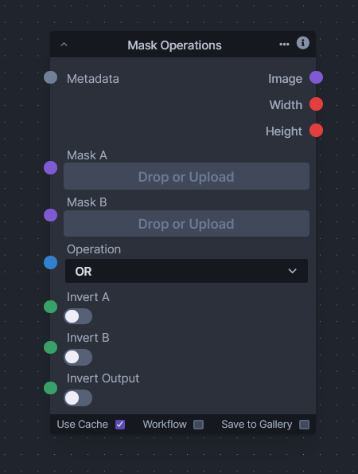

# Mask Operations

The "Mask Operations" node introduces essential logical operations for combining multiple mask images. This functionality is when dealing with image processing tasks that require the combination or subtraction of different masks to isolate or manipulate specific parts of an image.

Here are the operations provided by this node:

- OR (Lighter): This operation combines two masks by taking the lighter value of each corresponding pixel pair across the two masks. It's similar to a logical OR operation, where if one pixel in either of the masks is white (or "true"), the resulting pixel will be white. This is useful for merging areas of interest from both masks.

- SUB (Subtract): The subtract operation calculates the difference between two masks by subtracting the pixel values of the second mask ("Mask B") from the first mask ("Mask A"). This operation can be used to eliminate parts of "Mask A" where "Mask B" has white (or "true") pixels, effectively erasing sections of the mask.

- AND (Darker): This function performs a logical AND on two masks. It takes the darker value of each corresponding pixel pair, resulting in an intersection of the masks. Only the areas where both masks have white (or "true") pixels will remain white in the resulting mask. This is often used to produce a mask that includes only the areas where both original masks overlap.
